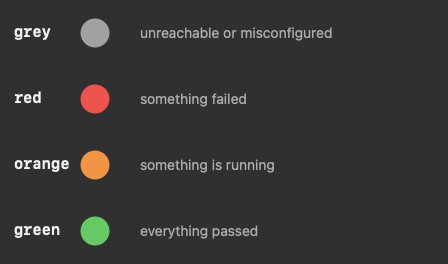
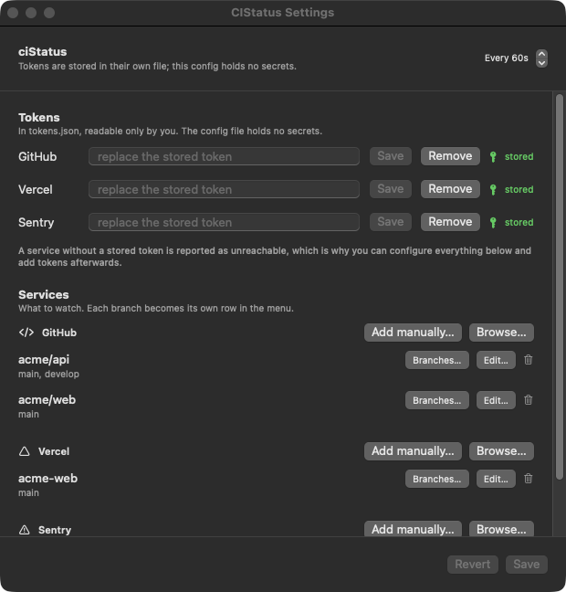

# ciStatus

A macOS menu bar app that shows the state of your CI in one coloured dot.


It polls three kinds of source and rolls them up into a single indicator:

| Source | What it reports |
| --- | --- |
| GitHub | the CI state of a branch's head commit, via the Checks API or the Actions API (see [Token permissions](#token-permissions)) |
| Vercel | the state of the latest deployment for a project and branch |
| Sentry | issues first seen within a rolling window |

The dot reflects the worst source, never an average.



Grey deliberately ranks *below* red, so an unreachable API can never hide a
failure that was detected. A branch with no checks yet is green, not grey.

## Quickstart

Needs macOS 13 or later and a token with read access to at least one of the
three services.

```sh
git clone git@github.com:davidonet/ciStatus.git && cd ciStatus
make test      # 144 tests, no network, about a second
make           # builds CIStatus.app and installs it to /Applications
```

Then add a token and tell it what to watch. Either paste tokens into the settings
window:

```sh
open -a CIStatus   # click the dot, then Settings…
```

or do the whole thing from a terminal:

```sh
swift build --product probe
.build/debug/probe --store-token github ghp_…      # read scope is enough
.build/debug/probe --enable github
```

`--store-token` enables the service for you, so a token and a target is all it
takes. Config lives at `~/Library/Application Support/CIStatus/config.json` and
tokens at `tokens.json` beside it.

To start it at login:

```sh
./Scripts/install-launch-agent.sh --install-tokens
```

Click the dot and the menu shows every row, a count of what needs attention, and
the last check time. Clicking a row opens that project's dashboard.

### The settings window



**Browse…** lists what your token can see — repositories, projects, branches — so
you pick rather than type. **Add manually…** asks for the same values and needs
no token at all, which is the way in when a token has no read scope or a service
refuses to list. **Edit…** on any row changes every field afterwards, including
the ones that identify the target, so a typo is fixable in place.

## Requirements

macOS 13 or later. Nothing to install beyond the build.

## Build and install

```sh
make            # build release, install to /Applications
make build      # build/CIStatus.app only
make test       # unit tests
```

`make build` produces `build/CIStatus.app`. Note that `swift build -c release`
on its own gives you a bare executable, not an app: with no `Info.plist` there
is no `LSUIElement`, so it shows up in the Dock and adds a second icon to the
menu bar. `Scripts/build-app.sh` does the bundling, and `make` calls it.

### Running it

Tokens are read from a file, so the app launches the same way from Finder,
Spotlight or a terminal:

```sh
make run
```

To start it at login, register a LaunchAgent:

```sh
./Scripts/install-launch-agent.sh --install-tokens
```

It prompts for a token per enabled service, writes them to `tokens.json`, and
writes a plist that starts the app at login. Run it without the flag to skip the
prompts. To undo it: `./Scripts/uninstall-launch-agent.sh`, adding `--tokens` to
remove the stored tokens as well.

## Releases

`.github/workflows/release.yml` builds the same app and attaches it to a GitHub
release. Tag and push:

```sh
git tag v0.1.0 && git push origin v0.1.0
```

The tag has to start with `v`, and the tests have to pass first, so a release is
only ever cut from a commit whose 144 unit tests are green. The build is a
universal binary (Apple silicon and Intel) packaged as a DMG, which users drag
into `/Applications`.

Pull requests and pushes to `main` run the tests only, without building an app.

Two things worth knowing:

- The app is **ad hoc signed**, because signing is what `build-app.sh` already
  does and no Developer ID certificate is needed. macOS will therefore ask for a
  one-time confirmation the first time a user opens it (right click, then Open).
  Notarising it to remove that prompt needs an Apple Developer Program
  membership and an Apple secret in the repository; add those steps to the
  workflow when you have one.
- The checkout uses `fetch-depth: 0` so `build-app.sh` can read the version from
  the tag. A shallow clone has no tags, and the app would be stamped `0.0.0`.

`Scripts/e2e.sh` is deliberately not part of CI: it screenshots the real menu
bar, so it needs a logged in GUI session and a human to look at it.

## Configuration

Config lives at `~/Library/Application Support/CIStatus/config.json`. Set
`CISTATUS_CONFIG` to point somewhere else.

The easiest way to write it is the settings window, shown above. It lists what
your tokens can actually see, so you pick repositories, projects and branches
from a list instead of typing them. A commented example ships in
`Sources/CIStatus/Resources/config.example.json`, and the file is written back in
the same shape, so editing it by hand stays a valid option.

A config that has targets but a service switched off is the usual reason for a
grey dot, and the app says so at startup and in the log:

```
ERROR GitHub has 1 target(s) configured but "tokens": { "github": true } is
      missing, so none of them will be polled.
```

### Tokens

One token per service, in `~/Library/Application Support/CIStatus/tokens.json`.
The config file only says which services are switched on, so it never holds a
secret and stays safe to commit:

```json
{
  "tokens": {
    "github": true,
    "vercel": true,
    "sentry": true
  }
}
```

A service that is not listed is off. That is deliberate: a leftover token for a
service you stopped watching will not keep polling it.

There are no environment variables involved. An exported `GITHUB_TOKEN` is
ignored, so a shell cannot change what the app authenticates with.

Paste a token per service in Settings and press **Save**, or from a terminal:

```sh
swift build --product probe
.build/debug/probe --store-token github ghp_…
.build/debug/probe --tokens          # what is stored, without printing values
```

`CISTATUS_TOKENS=/path/to/tokens.json` points at a different file, which is how
tests and side-by-side runs avoid touching the real one.

#### Why a file and not the Keychain

The login Keychain was tried first and prompted *"ciStatus wants to use your
confidential information"* on every rebuild. On the legacy login keychain an
item's ACL trusts the creating app by code signature, and `build-app.sh` re-signs
the app on every build, so every new build was a new signature and therefore a new
prompt. `kSecAttrAccessibleWhenUnlocked` does not avoid that; the data protection
keychain is what isolates per app, and it needs a signing entitlement an ad-hoc
build does not have.

The file is mode 600 and its directory 700, so other accounts cannot read it.

**What this costs, plainly:** it is plaintext on disk, so anything running as you
can read it, and an unencrypted Time Machine backup will contain it. That is the
same exposure as a `.env` file, which is what most tools use, and it is the
simplest arrangement that never asks you to click Allow. If a token must be
unreadable to other local processes, the Keychain is the only real option — and
with an ad-hoc build that means accepting the prompt on every rebuild.

### Services

What to watch, grouped by provider. Every section is optional, so a GitHub-only
config needs no empty Vercel or Sentry lists.

```json
{
  "services": {
    "github": [
      { "owner": "your-org", "repo": "api", "branches": ["main"] },
      { "owner": "your-org", "repo": "web", "branches": ["main", "develop"] }
    ],
    "vercel": [
      { "projectId": "prj_…", "name": "web", "teamId": "team_…", "branches": ["main"] }
    ],
    "sentry": [
      { "org": "your-org", "project": "web", "newWithinHours": 24 }
    ]
  }
}
```

A repository or project can watch several branches, and **each branch becomes
its own row in the menu** — `web · main` and `web · develop` are polled
independently. Omitting `branches` means `main`.

Every field can be typed by hand. In Settings, **Browse…** lists what your token
can see and fills these in for you; **Add manually…** asks for the same values
and needs no token at all. Use the manual route when a token has no read scope,
when a service refuses to list, or when you already know the values — a row
without a token reports as unreachable rather than being silently dropped.

### Changing a target

**Edit…** on any row opens the same fields, prefilled, and includes the identity
ones — owner/repo, projectId, org/project. A typo is therefore fixable without
deleting the entry and adding it again. An edit keeps the row's position in the
menu, and is refused if the new identity already exists elsewhere, since that
would leave the same target watched twice.

**Branches…** is the quicker route for branches when a token is available: the
list is ticked for what is already watched, and clicking a branch toggles it. A
branch can always be typed, which is the only way to add one the API does not
list — Vercel has no branch endpoint, so its list is derived from recent
deployments and a rarely deployed branch will not appear in it.

Optional fields you clear are removed from the config rather than written as
empty strings, so a saved file has no `"name": ""` litter.

Per target, `name` overrides the menu label, and `dashboardURL` overrides the
link a row opens. On GitHub, `strategy` picks the API (see
[Token permissions](#token-permissions)).

The menu lists each row with its state, a count of what needs attention, and the
time of the last check. Clicking a row opens its dashboard. Edit the file then
use **Reload config** in the menu; there is no need to restart.

A misspelled key is a loud error rather than being ignored, because a config
that silently watches nothing is much harder to notice than one that refuses to
load.

### Where the token goes

`~/Library/Application Support/CIStatus/tokens.json`, mode 600. The config file
names no variable and holds no value, so there is nothing to export and nothing
to rotate on a rebuild.

## Logging

Everything goes to `~/Library/Logs/CIStatus/ciStatus.log`, and **Reveal Log in
Finder** in the menu opens it. A menu bar app has no stdout, and a crash report
says nothing about why a row is grey, so this file is the diagnostic.

```
2026-10-02T09:41:02Z INFO    reading config from /Users/…/CIStatus/config.json
2026-10-02T09:41:02Z INFO    config loaded: 5 row(s) across 1 GitHub, 1 Vercel, 1 Sentry
2026-10-02T09:41:02Z INFO    GitHub: enabled, token present, 1 target(s)
2026-10-02T09:41:14Z INFO    poll welqin-ng · main: ok — 5 passed (Welqin/welqin-ng @ main)
2026-10-02T09:41:14Z ERROR   poll javascript-sveltekit: failing — 1 new issue
```

Lines are timestamped and levelled (`DEBUG`, `INFO`, `WARNING`, `ERROR`). The
file rotates at 1 MB and keeps three older copies; a single line is truncated at
4 KB so one large error body cannot bury everything after it.

**Tokens are never written.** Every line is filtered: the exact stored value is
masked, as is anything shaped like a `ghp_`, `github_pat_`, `vercel_`, `sk-` or
`sntrs_` token, so a token echoed back inside an API error body still does not
land on disk.

Two environment variables, for when you need more than the default:

```sh
CISTATUS_LOG_LEVEL=debug make run      # debug | info | warning | error
CISTATUS_LOG_FILE=/tmp/cistatus.log make run
```

`info` is the default; `debug` adds request-level detail.

### Diagnosing "configured but not working"

`make doctor` prints the three facts that explain most of it, without polling:

```sh
make doctor
#   GitHub: token stored, not enabled, 1 target(s)
# !! GitHub has 1 target(s) but is not enabled. Fix with: probe --enable github
```

A service with targets but no `tokens` entry is the usual cause, and the log
says so explicitly at startup. `make probe` polls everything and prints what the
menu would show.

## Token permissions

Everything the app does is a read. It never writes to any service, so no
service needs a write scope anywhere below.

| Service | Minimum to poll | Extra for the pickers |
| --- | --- | --- |
| **GitHub** | Metadata, Commit statuses, Actions — all `: read` | Checks: read |
| **Vercel** | Deployments read | Projects read |
| **Sentry** | `project:read` | `org:read` |

Grant the whole GitHub set including `Checks: read` and none of this is
conditional. Each section below ends with the exact endpoints the app calls, so
you can check a scope against them; the picker calls are the ones only needed
while choosing projects.

### GitHub

A fine-grained token, scoped to the repositories you watch.

| Permission | Why |
| --- | --- |
| **Metadata: read** | always required; names repos and branches |
| **Commit statuses: read** | merges in legacy commit statuses, and resolves the head SHA |
| **Actions: read** | the Actions API fallback, see below |
| **Checks: read** | the Checks API; **strongly recommended**, see below |

On the permissions page these read as *"Read access to actions, code quality,
commit statuses, and metadata"*, which is the whole requirement. Nothing else is
needed.

There are two APIs that can answer "is CI green on this branch", and they need
different permissions. `strategy` picks between them:

| `strategy` | API | Token permission | Sees |
| --- | --- | --- | --- |
| `auto` *(default)* | Checks, falling back to Actions | `Checks: read`, else `Actions: read` | everything available |
| `checks` | Checks | `Checks: read` | Actions **and** third-party CI |
| `actions` | Actions | `Actions: read` | Actions only |

`auto` is the default because `Checks` is not offered for every GitHub account
or plan. If your token cannot read check runs, the app falls back to the
Actions API automatically and the menu row is marked `· actions only`.

The fallback is narrower, and it is worth knowing what you lose. The Actions
API only reports GitHub's own workflows, so checks posted by other apps are
invisible. On `nuxt/nuxt@main` for example, the Checks API reports 5
third-party checks (Socket Security, Flakiness, pkg-pr-new) that the Actions
API does not see at all. If you rely on any of those, grant `Checks: read` and
keep the default.

To resolve a branch to its head commit, the fallback uses the combined status
endpoint — the one that needs `Commit statuses: read` rather than
`Actions: read`. That is the fourth permission in the set named above.

A classic personal access token with the `repo` scope also works and needs no
configuration at all. It cannot be limited to read-only.

| Call | Endpoint | Used for |
| --- | --- | --- |
| list | `GET /repos/{o}/{r}/commits/{ref}/check-runs` | the Checks API |
| list | `GET /repos/{o}/{r}/commits/{ref}/status` | legacy statuses, head SHA |
| list | `GET /repos/{o}/{r}/actions/runs` | the Actions API fallback |
| list | `GET /repos/{o}/{r}/branches` | the branch picker |
| list | `GET /user/repos`, `GET /users/{owner}/repos` | the repository picker |

### Vercel

A token from [vercel.com/account/tokens](https://vercel.com/account/tokens),
scoped to the **team** that owns the project. `teamId` in the config must match
that scope, or every call returns 403.

| Permission | Why |
| --- | --- |
| Read access to **Deployments** | reads deployment state |
| Read access to **Projects** | the project picker |

Both are read-only and available on any Vercel plan. A personal token works too
and needs no `teamId`.

| Call | Endpoint | Used for |
| --- | --- | --- |
| list | `GET /v7/deployments` | deployment state, and deriving branches |
| list | `GET /v9/projects` | the project picker |

### Sentry

An internal auth token from **Settings → Auth Tokens**, not a legacy API key.

| Scope | Why |
| --- | --- |
| `project:read` | reads issues |
| `org:read` | the organisation and project pickers |

`project:read` alone is enough to poll a config that already names its org and
project; `org:read` is only needed for the pickers.

| Call | Endpoint | Used for |
| --- | --- | --- |
| list | `GET /api/0/projects/{org}/{project}/issues/` | new issues in the window |
| list | `GET /api/0/organizations/` | the organisation picker |
| list | `GET /api/0/organizations/{org}/projects/` | the project picker |

Self-hosted Sentry is not supported: the URLs are built for `sentry.io`.

### Checking a token before you wire it up

The settings window tells you. A wrong token shows the HTTP status and what it
means — `401` is a rejected token, `403` is a missing scope or the wrong team.

To check from a terminal instead:

```sh
curl -s -o /dev/null -w '%{http_code}\n' https://api.github.com/user \
  -H "Authorization: Bearer $(python3 -c 'import json,sys; print(json.load(open(sys.argv[1]))["github"])' \
    ~/Library/Application\ Support/CIStatus/tokens.json)"
```

`200` means the token is valid; `401` means it is not; `403` on an otherwise
valid token usually means the repository scope excludes what you are asking for.
`400` here means no token is stored, since the substitution came back empty.

## Development

```sh
swift test                    # 144 unit tests, no network
make doctor                   # what is stored, enabled and missing
make probe                    # poll your own config from the terminal
```

`probe` prints what the app would show, which is the fastest way to tell a bad
token from a bad config:

```sh
.build/debug/probe ~/path/to/config.json
# ok      | api · main   | 12 passed                | your-org/api @ main
# failing | web · prod   | ERROR: Command failed    | target: production · sha: 0123abc
# unknown | Sentry · web | unreachable              | HTTP 404 …
```

`probe --overall <config>` prints just the rolled-up health, which is how the
end-to-end check derives what the dot should be.

`probe --render-dots <path>` regenerates the colour legend at the top of this
file, using `StatusDot` itself rather than a reimplementation, so the picture
cannot drift from what the menu bar draws.

### Verifying the icon

The dot is the product and it only exists on the real menu bar, so
`Scripts/e2e.sh` launches the built app, screenshots the bar, and classifies the
pixels the icon added by diffing against a baseline taken with the app not
running. It then compares that to the health the providers compute:

```sh
swift build -c release
swift build --product probe && swift build --product probe3
./Scripts/e2e.sh /path/to/config.json
# computed health: failing
# dot 14x14 at 3085,8 from 132 px rgb=240,177,76
# => RED
# PASS: icon is RED, matching the computed health
```

Tokens are read from the token file, so nothing needs exporting. It needs a
logged-in GUI session, and it reads the real screen, so treat a failure as a
prompt to look rather than a hard gate.

## Layout

```
Sources/CIStatusKit/    all the logic, so it is testable without an app bundle
  Health.swift          severity enum and the roll-up
  Config.swift          the config schema, and the expanded polling units
  TokenStore.swift      the token file, mode 600
  HTTP.swift            small async JSON client
  GitHubProvider.swift
  VercelProvider.swift
  SentryProvider.swift
  Monitor.swift         the poll loop
  StatusDot.swift       draws the coloured dot
  Discovery.swift       lists repos, branches and projects for the settings UI
  Log.swift             file logging, with token redaction
Sources/CIStatus/       the SwiftUI menu bar extra and settings window
  SettingsView.swift    tokens and services, with the pickers
  SettingsModel.swift   holds the draft config and runs discovery
  TargetEditorSheet.swift adding a target, or editing one already configured
Sources/probe/          terminal front end, plus `--doctor`-style diagnosis
Sources/probe3/         menu bar pixel classifier used by the e2e check
Tests/CIStatusTests/    144 tests; the providers are tested against stubbed HTTP
docs/                   screenshots and the generated colour legend
```

## Notes

- Menu bar icons are drawn as template images, which discard colour, so
  `StatusDot` bakes the tint into the pixels with `isTemplate = false`. A plain
  SF Symbol would render black no matter what colour you apply.
- The Actions fallback filters workflow runs by `head_sha`, not by `branch`.
  Filtering by branch alone returns every commit ever pushed to it, so a
  failure from last month would keep the dot red forever.
- Both GitHub APIs cap a page at 100. When there are more, the summary says how
  many were not shown and the row reads as *pending* rather than green, so a
  partial view is never mistaken for a clean one.
- Sentry's search syntax is sent as a single query string; the window is
  `firstSeen:-<hours>h`.
- The settings window is a `Settings` scene rather than a `Window`, because that
  is the scene that registers the action the menu item sends, and it gets the
  standard Cmd-, shortcut for free.
